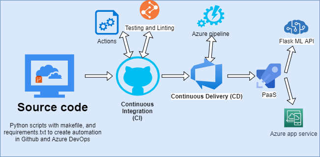

[](https://github.com/mahfuzmr/DevOpsCICD/actions/workflows/pythonapp.yml)
# Agile Development with Azure Project: Building a CI/CD Pipeline

## Overview

This demo project demonstrates the steps of automation with DevOps and the overall guidelines of the CI/CD pipeline.This repo represents an ML web application that is run, built, tested, and deployed through GitHub action and azure pipelines. this project depicts the important minimum steps of DevOps integration and continuous improvement (KAIZEN).

This repository are demonstrated with instruction as follows:
- [Project Plan](#project-paln) 
- [Trello board](#trello)
- [Integrating with Github Action](#integration-with-github-action)
- [Azure Pipeline setup](#azure-pipeline)
- A [demo](#work-flow-demo) descriptive vedio


The overall architecture of this project is as follows:



# Project Paln 
* Qaterly plan [Qaterly plan](https://docs.google.com/spreadsheets/d/1Bn9ZQgle6v80NKEdfrtuNLnAG6NSBL9CRmgfJ8xCKZw/edit#gid=213763889)
* Weekly project plan for complete year(:anger: With complexity indication by color :anger:) [Weekly Plan](https://docs.google.com/spreadsheets/d/1Bn9ZQgle6v80NKEdfrtuNLnAG6NSBL9CRmgfJ8xCKZw/edit#gid=1348135932)

# Trello 
* Project workspace on [Trello](https://trello.com/invite/b/kwXF8kaZ/04fdfb33a716cb77f0a5cba7c01f9e32/devopscicd)

#Instraction
## Creating a repository in github
Using your GitHub account first create a repo with azure pipeline enabled. Azure pipeline could be installed through Github [Marketplace](https://github.com/marketplace?type=)

1. Sign in into you azure account at (https://portal.azure.com)
2. Open Azure CLI and select the Bash from the coloud Shell window


3. Clone the repo into azure cloud

```bash
mahfuzur@Azure:~$ git clone git@github.com:mahfuzmr/DevOpsCICD.git
mahfuzur@Azure:~$ cd DevOpsCICD
```


4. Run command to create virtual invironment for your application. Then activate the created python environment
```bash
python3 -m venv ~/.flask-ml-azure
source ~/.flask-ml-azure/bin/activate
```
5. Run command to install all dependencies from the requirements.txt file

```bash
make install
```
And the output sould look ike the follows:


# Integration with Github Action

When the system is successfully installing all the dependencies from the requirements.txt file in step 5.It is time to create CI through github [Action](https://github.com/features/actions)
* After login to the created repo Click on the Action Tab and "Set up a workflow". This will create a .yml file which has the pre written code for automation

 
 
 * And when we create the .yml file and commit the build automation will be autometically triggereg. The succesfull build automation will look like as follows:

 


6. Create an app service and which will deploy the app in Cloud Shell:


7. Update the "URL" in the file **make_predict_azure_app.sh**
```bash
-X POST https://<**my-ml-app-service**.azurewebsites.net:$PORT/predict> 
```


9. Set your app deployed and running in a seperate web browser. If the deployment is successfull is will show the initial message in the browser


10. Now its time to test locally 
* Build the app using app.py
 ```bash
    python app.py
```
* In a seperate browser tab open bas from the azure CLI again and run dommand to check the prediction locally
A successful prediction will look like this:


# Azure pipeline

# Work flow Demo


