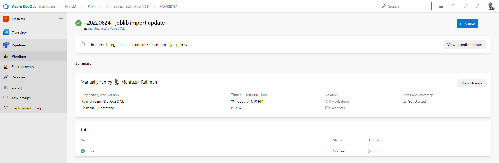

[](https://github.com/mahfuzmr/DevOpsCICD/actions/workflows/pythonapp.yml)
# Agile Development with Azure Project: Building a CI/CD Pipeline

## Overview

This demo project demonstrates the steps of automation with DevOps and the overall guidelines of the CI/CD pipeline. This repo represents an ML web application that is run, built, tested, and deployed through GitHub action and azure pipelines. this project depicts the important minimum steps of DevOps integration and continuous improvement (KAIZEN).

This repository is demonstrated with instructions as follows:
- [Project Plan](#project-paln) 
- [Trello board](#trello)
- [Integrating with Github Action](#integration-with-github-action)
- [Azure Pipeline setup](#azure-pipeline)
- A [demo](#work-flow-demo) descriptive video


The overall architecture of this project is as follows:


# Project Plan 
* Quarterly plan [Qaterly plan](https://docs.google.com/spreadsheets/d/1Bn9ZQgle6v80NKEdfrtuNLnAG6NSBL9CRmgfJ8xCKZw/edit#gid=213763889)
* Weekly project plan for a complete year(:anger: With complexity indication by color :anger:) [Weekly Plan](https://docs.google.com/spreadsheets/d/1Bn9ZQgle6v80NKEdfrtuNLnAG6NSBL9CRmgfJ8xCKZw/edit#gid=1348135932)

# Trello 
* Project workspace on [Trello](https://trello.com/invite/b/kwXF8kaZ/04fdfb33a716cb77f0a5cba7c01f9e32/devopscicd)

#Instraction
## Creating a repository in Github
Using your GitHub account first create a repo with azure pipeline enabled. Azure pipeline could be installed through Github [Marketplace](https://github.com/marketplace?type=)

1. Sign in to you azure account at (https://portal.azure.com)
2. Open Azure CLI and select the Bash from the cloud Shell window


3. Clone the repo into the azure cloud

```bash
mahfuzur@Azure:~$ git clone git@github.com:mahfuzmr/DevOpsCICD.git
mahfuzur@Azure:~$ cd DevOpsCICD
```


4. Run command to create virtual environment for your application. Then activate the created python environment
```bash
python3 -m venv ~/.flask-ml-azure
source ~/.flask-ml-azure/bin/activate
```
5. Run the command to install all dependencies from the requirements.txt file

```bash
make install
```
And the output should look like the follows:


# Integration with Github Action

When the system is successfully installing all the dependencies from the requirements.txt file in step 5. It is time to create CI through GitHub [Action](https://github.com/features/actions)
* After login to the created repo Click on the Action Tab and "Set up a workflow". This will create a .yml file that has the pre-written code for automation

 
 
 * And when we create the .yml file and commit the build automation will be automatically triggered. The successful build automation will look as follows:

 


6. Create an app service which will deploy the app in Cloud Shell:

```bash
-az webapp up -n my-ml-app-service
```


7. Update the "URL" in the file **make_predict_azure_app.sh**
```bash
-X POST https://<**my-ml-app-service**.azurewebsites.net:$PORT/predict> 
```


9. Set your app deployed and running in a separate web browser. If the deployment is successful is will show the initial message in the browser


10. Now its time to test locally 
* Build the app using app.py
 ```bash
    python app.py
```
A successful build will show as in the following depiction


* In a separate browser tab open bash from the azure CLI again and run command to check the prediction locally
A successful prediction will look like this:


# Azure pipeline

At step 9 our application is successfully integrated with the azure app service, GitHub action, and generating prediction. We will now move to our continuous delivery process with the azure pipeline.

10. At this time our system is ready to go on the pipeline process. The following steps will create a successful CD process.

* Inthe azure portal create a new project 

* Head to Pipelines and click on 'New pipeline'.
* From the setting menu connect the specific Github Repo
* Configure the pipeline with the starter pipeline
* Based on the latest commit Azure pipeline will create a starter basic YAML file (default)
* When we save the file it will create pipeline JOB and run the process. A successful job build will look as follows:




#Now every commit from the git hub will trigger CI in Github actions and also in Azure Pipeline


# Work flow Demo
